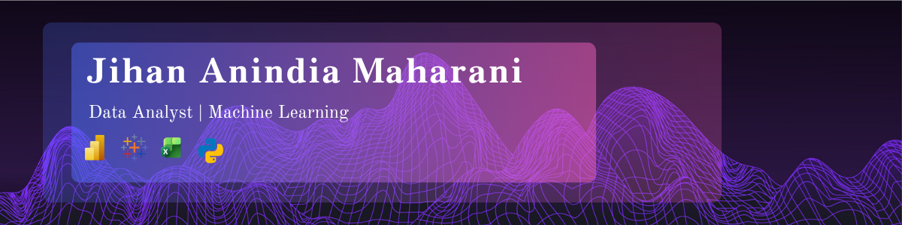

<!-- Banner - ganti dengan gambar banner kamu sendiri -->

 

# Jihan Anindia Maharani

**Data & Machine Learning Enthusiast** | **IT Enthusiast** 

 

<!-- Avatar + Typing SVG - ganti sesuai kebutuhan -->
<table>
<tr>
<td width="150">

</td>
<td>

</td>
</tr>
</table>

## 👤 About Me

Hello, I'm Jihan 👋  an Information Systems graduate from Universitas Binaniaga Indonesia. I have hands-on experience in system and data analysis through various academic projects and an internship. I'm enjoy working with data and turning it into useful information. My strengths are analytical thinking, attention to detail, and programming, and I'm used to working both independently and as part of a team. 🙂

---

### 🧰 Tech Stack

---

📍 Bogor, Indonesia · ✉️ (mail to:zuyizujihan208@gmail.com) · 🌐 ((https://jihanindia.github.io/jihan_portofolio/))

